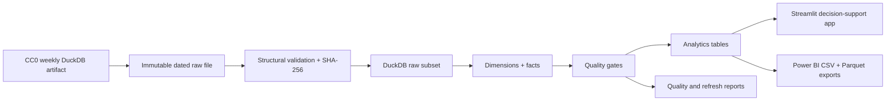

# Football Recruitment & Development Intelligence

[](https://fri-tiago-marques.streamlit.app/)
[](https://github.com/Tiago-Analyst/Football-Recruitment-Intelligence-by-Tiago-Marques/actions/workflows/tests.yml)
[](https://github.com/Tiago-Analyst/Football-Recruitment-Intelligence-by-Tiago-Marques/actions/workflows/refresh_data.yml)

**[Explore the live bilingual dashboard](https://fri-tiago-marques.streamlit.app/)** · English and Portuguese (Portugal)

A reproducible football analytics portfolio project that examines how Portuguese clubs recruit players, provide development minutes, structure squads, create market value and sell into other leagues. It is built as decision support for sporting directors, recruitment and scouting teams, academy/loan managers, executives and analysts—not as a goals-and-league-table dashboard.

## Business question

> How do football clubs recruit players, create value, manage development pathways and generate transfer returns?

The MVP focuses on clubs historically covered by Liga Portugal (`PO1`). The configuration and warehouse use source IDs and country/competition dimensions so additional markets can be added later.

## Product modules

1. Transfer Market Overview
2. Club Recruitment Strategy
3. Talent Development Monitor
4. Loan Player Tracker (controlled unavailable state)
5. Club Selling Model
6. Squad Planning and Age Structure
7. Transfer Pathways
8. Portuguese Players Abroad
9. Player Profiles
10. Methodology and Data Quality
11. About the Author

## Architecture



The pipeline is idempotent: it rebuilds the warehouse from an immutable source file, preserves source identifiers, records the artifact hash and run metadata, and stops on critical quality failures.

## Data-source selection

The selected source is [dcaribou/transfermarkt-datasets](https://github.com/dcaribou/transfermarkt-datasets): a CC0, weekly refreshed DuckDB/CSV publication with stable player/club IDs, transfers, appearances, valuations, games, competitions and player profiles. The validated artifact contained 50,149 players, 35,139 transfers, 1,894,350 appearances and 507,815 valuations. Portuguese top-flight match coverage runs from 2012/13 through 2025/26.

OpenFootball and football-data.org were tested and documented but not merged: they add fixtures/results, not the transfer/value depth central to the product, and no reliable cross-source player bridge exists. See [source research](docs/source_research.md).

## Installation

Python 3.11 or newer is required.

```bash
python -m venv .venv
# Windows: .venv\Scripts\activate
# macOS/Linux: source .venv/bin/activate
python -m pip install -r requirements.txt
```

Copy `.env.example` to `.env` only if you later add authenticated sources. The selected source needs no credentials.

## Run

Full online refresh:

```bash
python scripts/10_run_full_pipeline.py
```

Rebuild from a previously validated local artifact:

```bash
python scripts/10_run_full_pipeline.py --source-file data/raw/source_validation/transfermarkt-datasets.duckdb --offline
```

Launch the app:

```bash
python -m streamlit run app/streamlit_app.py
```

The application is bilingual. Use `Language / Idioma` in the sidebar to switch
between English and European Portuguese; navigation, filters, KPIs, charts,
messages, methodology and displayed analytical categories update immediately.

Run validation and tests:

```bash
python -m pytest
python -m ruff check .
```

## Automation and public deployment

GitHub Actions runs lint/tests on pushes and pull requests. A scheduled workflow refreshes the source weekly, rebuilds and validates the database, publishes the latest trustworthy DuckDB warehouse as a GitHub Release asset and updates the small version manifest consumed by Streamlit. A failed refresh leaves the previous public warehouse active. See [public deployment](docs/deployment.md) and [local automation](docs/automation.md).

## Power BI

UTF-8 CSV and Parquet exports are written to `output/powerbi/`. Import dimensions first, then facts, and use single-direction one-to-many filters. Full relationship and measure guidance is in [Power BI setup](docs/powerbi_setup.md).

## Portfolio highlights

- End-to-end Python/SQL ETL from a weekly CC0 source to a dimensional DuckDB warehouse.
- Automated quality gates, SHA-256 verification, GitHub Releases and cloud refreshes.
- Eleven decision-support modules plus transparent methodology and controlled unavailable states.
- Bilingual Streamlit interface with interactive filters, Plotly visualisations and downloadable tables.
- Power BI-ready CSV and Parquet exports generated from the same governed analytics model.

## Evidence boundaries and limitations

- The source does not provide a trustworthy transfer-type flag. Zero fees are `unknown_or_zero`, never automatically “free” or “loan”.
- The Loan Player Tracker is disabled until a source provides parent club, loan club and loan dates/types.
- Academy origin is unavailable, so academy-integration metrics are excluded.
- Liga Portugal 2 player-level data is not present in the primary artifact; match-only alternatives are not entity-merged.
- Reported transfer-fee totals include positive known fees only and are not estimates of the full market.
- Current contract-expiry fields are exposed with a caution and are not reconstructed historically.
- Market-value figures are third-party estimates, not realised prices.

## Roadmap

- Add a licensed loan/contract source with stable player identifiers.
- Add Liga Portugal 2 when entity-safe player and appearance data becomes available.
- Introduce controlled review workflows for cross-source matching.
- Add competition-strength reference data and club-spell-aware value attribution.
- Deploy snapshots so strategic changes can be compared over refreshes.

## Author

Developed by **Tiago Marques**, Data Engineer and Business Intelligence professional with an interest in football analytics, scouting and performance analysis.

[LinkedIn](https://www.linkedin.com/in/tiagomarques-/) · [Email](mailto:tiagoamarcolino@gmail.com) · [Live dashboard](https://fri-tiago-marques.streamlit.app/)
